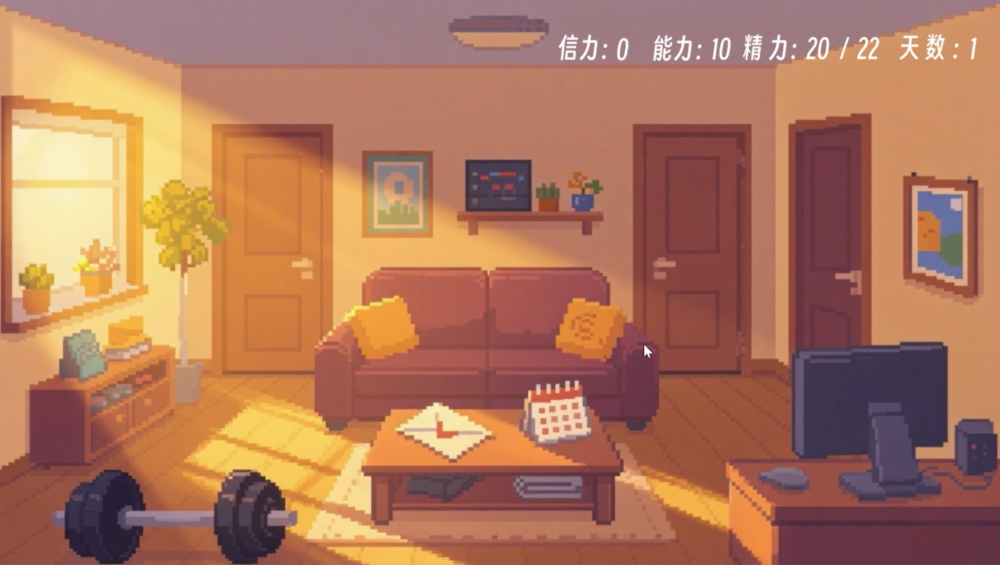
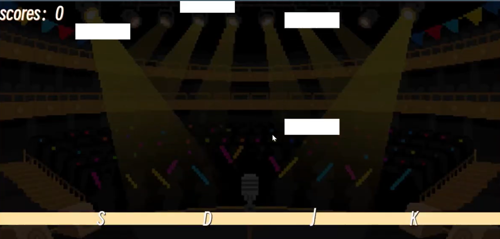
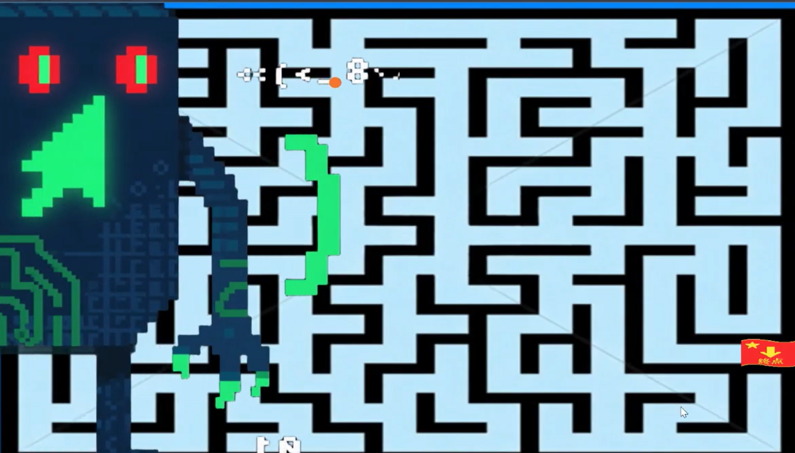

---


# The Helper from Paradise

> A narrative-driven interactive game about a grandfather who returns from the afterlife to help his family — one choice at a time, within 30 days.

## Demo Video

[Click to watch the demo video](https://youtu.be/OfZvBYzZoP8)

## Screenshots







## About the Project

I made this little game with a few friends over the break. We're all game enthusiasts, and after years of playing, we thought—why not try making one ourselves?

*The Helper from Paradise* is a narrative-driven interactive game centered around family and companionship. The story follows an elderly man who, after passing away, unexpectedly gets a chance to return to the living world. In 30 days, in the form of a "spirit," he accompanies his family and helps them navigate their struggles. Every choice the player makes affects the family's state and leads to one of four distinct endings.

When we first discussed the type and mechanics of the game, we decided to let the plot guide the game. We wanted a warm, heartfelt tone, so I drew inspiration from the support and care my own family has given me—the importance of communication in daily life, and how trust helps people grow and positively influence one another. That became the foundation: a story driven by family interactions.
s
During brainstorming, I found myself thinking about where people go after death. From a materialist perspective (even though this story is far from materialist), nothing simply disappears. I remembered Liu Cixin's short science fiction story. In it, a young woman travels on a lightspeed ship, leaving her partner behind. Eventually, the partner decided to build his own lightspeed ship to reach the end of time, where, according to the Big Bang theory, the universe collapses back into a singularity—and everything is together again. At that moment, he and she would be reunited. That idea deeply moved me. Perhaps the matter that makes up a person never truly leaves; it cycles through the world, staying with us in another form.

**Core Theme**: Companionship is the best help; trust is the best communication.

## Tech Stack

| Area| Tools|
|-----------|-------------------|
| Game Engine| Godot Engine 4.41 |
| Programming Language | GDScript          |
| Dialogue System      | Dialogic Plugin   |
| Art                  | AI Tools + SAI2   | 
| Music                | Original Composition|

## Technical Implementation

This project is built with **Godot Engine** using **GDScript**. 

As this was our first time working with Godot, and we had only one month to go from learning to delivery, we adopted **AI-assisted development** to accelerate the workflow:

- I designed the **dialogue data structure, branch logic, and state tracking system** — defining *what* the system should do
- AI tools were used to generate boilerplate code, which I then **debugged, integrated, and optimized**
- This approach allowed us to focus our energy on **game design, system architecture, and team coordination**, ultimately delivering a fully playable game within a tight timeline

For me, this project reinforced that **engineering is about problem definition and system design** 
 
## My Role

I served as **Project Lead and Technical Architect** for this project, completed over the summer break (Aug 3 – Sep 2) with three collaborators.

| Responsibility | Details |
|----------------|---------|
| **Project Lead** | Coordinated programming, art, and music resources to ensure timely delivery |
| **System Design** | Built the overall game framework and defined level progression logic |
| **Dialogue System Architecture** | Wrote the full script; designed dialogue data structure using the Dialogic plugin in Godot, defined branching conditions and variable tracking logic, and collaborated with a developer on implementation |
| **Art Coordination** | Used AI tools + SAI2 to create some assets; coordinated with another artist to maintain visual consistency |
| **Music Coordination** | Communicated with the composer to define musical direction and ensure alignment with narrative tone |

### Team Members

- **Quge Shi (Myself)** : System architecture, framework design, narrative writing, art assets, project management
- **Xuewei Shen** : Level design and implementation, scene art
- **Qianhan Zhou** : Original background music. She is incredibly talented! My elementary school deskmate and longtime friend.
- **Jiale Li** : My good friend! Helped generate several art assets.

## Core Systems

### 1. Branching Dialogue System

I used Godot's **Dialogic plugin** as the foundation for the dialogue system and extended it with:

- **Dialogue Structure**: Designed dialogue trees with branching options, conditional jumps, and variable tracking using Dialogic's visual editor
- **Global State Integration**: Connected Dialogic's variable system with the global state manager (`Global.gd`), allowing dialogue choices to affect in-game values (Faith Value, Ability Value, etc.)
- **Level Transitions**: Used Dialogic's custom signals to trigger scene changes and level loading at the end of dialogues

### 2. State Tracking System

Defined a global state pool tracking the following variables:

- `Energy`: Affects how many actions the player can take
- `Ability`: Affects skill unlock progress
- `Faith Value` (0-100): Affects which ending is reached
- `Days`: 30-day countdown affecting game pace

These states are determined by the player's dialogue choices and actions, and subsequent levels load different content based on state values.

### 3. Multiple Endings

The game features 4 endings, determined by Faith Value and hidden item collection:

| Ending | Trigger Condition |
|--------|-------------------|
| BD1    | 30-day timer expires without completing all tasks |
| BD2    | Faith Value 0-30 |
| GD1    | Faith Value 31-70, no hidden items |
| TD (True Ending) | Faith Value 31-70, all hidden items collected |

### 4. Mini-Games

To enrich the gameplay, I embedded four mini-games into the main storyline:

- **Attachment Mini-Game**: A cursor-timing mechanic representing the soul's control over objects
- **Rhythm Game**: A rhythm-tapping mechanic used in the grandmother's singing scene
- **Maze Escape**: A timed rightward movement puzzle used in the lottery scene
- **Hidden Level**: You'll have to play to find out!

## Challenges & Solutions

### Challenge 1: Frequent Merge Conflicts in Team Collaboration

**Problem**: Difficulty merging the project.

**Solution**: We directly copied levels into the main folder and handled transitions using conditional logic.

### Challenge 2: Art Generation Difficulties

**Problem**: None of us had formal art training. Getting AI to generate consistent, style-cohesive assets was extremely difficult—especially when the same character needed multiple expressions.

**Solution**: Combined AI generation with hand-painting in SAI2 to refine and unify the style.

## Project Outcomes

- Completed **4 main chapters + 1 hidden chapter**
- Implemented **4 distinct endings**
- Wrote **approximately 10,000 words** of original narrative
- Designed **4 types of mini-games**

## How to Play

### Option 1: Direct Download (Recommended)

1. Go to the [Releases](https://github.com/gege223333/The-Helper-from-Paradise/releases) page
2. Download `天堂帮手-可执行文件.zip`
3. Extract and double-click the `.exe` file to start the game

### Option 2: Run from Source Code

1. Install [Godot Engine 4.41](https://godotengine.org/download) or later
2. Clone this repository:
   ```bash
   git clone https://github.com/gege223333/The-Helper-from-Paradise.git
   ```
3. Open the project with Godot by selecting `project.godot`
4. Press F5 to run the game

## Credits

| Type | Source |
|------|--------|
| Code Assistance | DeepSeek |
| Art Assets | Doubao AI + SAI2 (hand-modified) |
| Music | Original composition |
| Sound Effects | Ear0.com (CC0) - "Thunder" by Alpert |

## Acknowledgments

Finally done… I would like to sincerely thank my friends Qianhan Zhou and Jiale Li. Although they are not from our school, they were willing to work on this project for free because of our ten-plus years of friendship (though we did treat them to a meal!).

Qianhan Zhou, a physics major, is exceptionally talented in music composition. Every piece she wrote for this project is absolutely wonderful—words cannot fully express it. It's the kind of music that feels like a melody from heaven!

Thank you to Jiale Li for fighting against AI on the art side and helping us generate several character designs.

I'd also like to give a shout-out to Xuewei and myself — two coders worked hard… it wasn't easy staring at lines of code and breathing life into them.

Finally, thank you for experiencing this unpolished but heartfelt work that we poured so much effort into.

---

*This project was created for academic purposes.*
